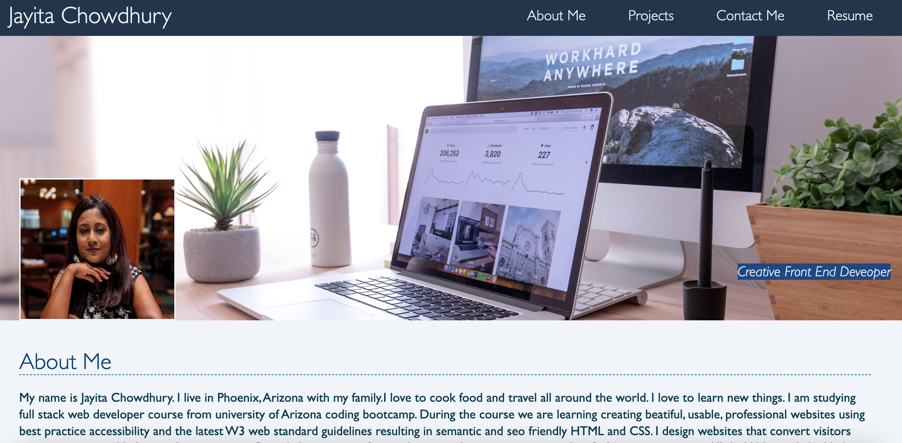
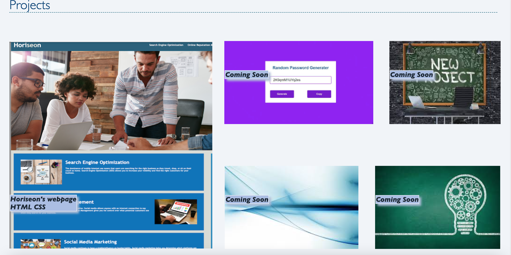

# Jayita's Portfolio

## Description

This project's purpose is to create a portfolio of work that showcases my skills and talents to employers looking to fill a part-time or full-time position. 

## Table of Contents
* [Installation](#installation)
* [Usage](#usage)
* [License](#license)
* [Tests](#tests)
* [Deployed Site](#deployed)
* [Contact](#contact)

## Installation 
No installation needed. 

## Usage 
This project's purpose is to create a portfolio of work that showcases my skills and talents to employers looking to fill a part-time or full-time position. 
Please view deployed Git Hub [URL](https://jayita87.github.io/My-Portfolio/)

## License 
This project is license under MIT

## Tests
There are no tests for this application as the project was about code refactoring.

## Code Deployed
Code deployed at https://jayita87.github.io/My-Portfolio/ 

## Contact
If you have any questions about this projects, please contact me directly at jayita.chowdhury.1987@gmail.com. You can view more of my projects at https://github.com/jayita87.
